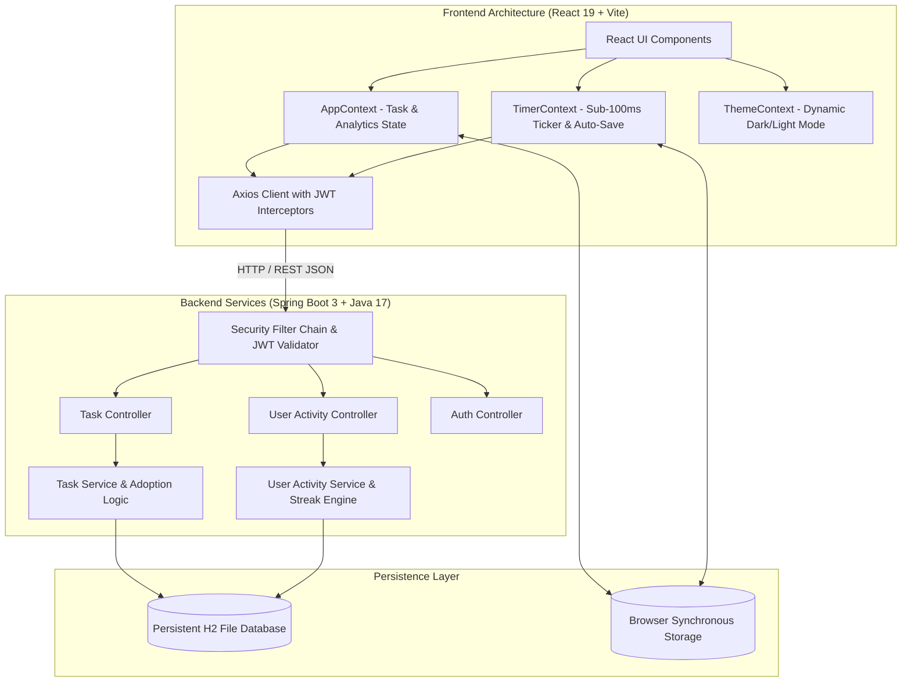

<div align="center">

# ⚡ FocusFlow — Enterprise Productivity & Focus Analytics Platform

[](https://react.dev/)
[](https://vitejs.dev/)
[](https://tailwindcss.com/)
[](https://spring.io/projects/spring-boot)
[](https://www.oracle.com/java/)
[](https://jwt.io/)
[](https://github.com/Snehasich/Focus-timer-app)
[](LICENSE)

<p align="center">
  <b>A full-stack, enterprise-grade deep work analytics system built with React 19, Spring Boot 3, and real-time state synchronization.</b>
</p>

[Architecture](#-system-architecture) • [Engineering Highlights](#-engineering-highlights) • [Features](#-key-features) • [API Specification](#-api-endpoints) • [Quick Start](#-quick-start)

---

</div>

## 📖 System Overview

**FocusFlow** is an ultra-high performance, full-stack productivity workspace engineered to solve digital fatigue and lack of accountability in deep work sessions. Designed with a micro-services ready architecture, FocusFlow seamlessly combines a **Pomodoro Focus Engine**, **LeetCode-Style Activity Analytics Heatmap**, **Optimistic Task Execution Pipeline**, **High-Precision Stopwatch**, **Markdown Notes Workspace**, and **Calendar Scheduling** into an enterprise dashboard.

Whether deployed locally or on cloud infrastructure, FocusFlow delivers sub-millisecond UI responsiveness, background data persistence, and end-to-end security compliance.

---

## 🏗️ System Architecture

FocusFlow follows a decoupled, stateless client-server architecture utilizing **RESTful endpoints**, **JSON Web Tokens (JWT)** for zero-session backend auth, and an **Optimistic Global State Pipeline** for real-time state sync.



---

## 🧠 Engineering Highlights & Architectural Innovations

### ⚡ 1. Real-Time Optimistic State & Zero-Wait Latency Compensation
- **Optimistic UI Engine**: All task operations (create, toggle, delete, bulk action) update the client state **instantly**, avoiding blocking network roundtrips.
- **Background Synchronization**: Data changes are asynchronously posted to Spring Boot REST endpoints in the background. If a network disruption occurs, synchronous local storage fallbacks prevent data loss.

### ⏱️ 2. Sub-100ms High-Precision Timer Engine
- **Non-Throttled Ticker**: Utilizes high-frequency polling intervals combined with timestamp delta calculation (`Date.now() - focusStartedAt`) to maintain millisecond-accurate time tracking even when browser tabs enter background throttling states.
- **Continuous State Persistence**: Timer state is saved to `localStorage` every second, allowing seamless restoration upon page refresh or browser restarts.

### 📊 3. Automated Activity & LeetCode Heatmap Calculation
- **Unified Activity Logging**: Any meaningful interaction (app visits, task edits, note creations, pomodoro cycles) automatically logs an entry for the current date.
- **Dynamic Heatmap Generation**: Renders a 52-week activity grid with 5-level green color scaling based on real-time focus seconds and daily user actions.

### 🔐 4. Enterprise JWT Authentication & CORS Security
- **Stateless Auth**: Secured using Spring Security with BCrypt password hashing and custom JWT authentication filters.
- **Cross-Origin Resource Sharing (CORS)**: Configured with explicit header permissions (`addAllowedOriginPattern("*")`) supporting safe cross-domain REST integration.

### 💾 5. Resilient Database Persistence & Data Adoption
- **Persistent Disk Storage**: H2 database configured in file mode (`jdbc:h2:file:./data/focusflowdb`) guaranteeing data persistence across server restarts.
- **Guest-to-Authenticated Migration**: Automatically adopts guest tasks and activity history upon user registration/login.

---

## ✨ Key Features

| Module | Features & Technical Capabilities |
| :--- | :--- |
| **⏱️ Focus Engine** | Animated SVG progress ring, customizable intervals (15m/25m/45m/60m), mode change safety alerts, auto-logging. |
| **⏱️ Stopwatch** | High-precision `requestAnimationFrame` ticker, lap recording with fastest/slowest lap visual highlights. |
| **📋 Tasks Workspace** | Real-time task progress ring, optimistic additions/deletions, alphabetical & status sorting, bulk operations. |
| **📊 Activity Heatmap** | 12-month 52-week LeetCode activity grid, live streak calculator (`🔥 N Days`), weekly focus bar charts. |
| **🏆 Gamification & XP** | Dynamic XP formula based on focus minutes, completed tasks, and streak days. Automated Level & Badge unlocking. |
| **📓 Rich Notes** | Markdown support, word counter, estimated reading time, favorite pinning, tag filtering, file attachment previews. |
| **📅 Calendar View** | Monthly interactive calendar mapping scheduled tasks and historical activity dots. |
| **🌗 Theme System** | Sleek dark mode (`#0b0b0b`) and light mode (`#ffffff`) theme switching with smooth CSS transitions. |

---

## 📡 API Specification

### **Authentication**
```http
POST /api/auth/register     Registers a new user account
POST /api/auth/login        Authenticates user & returns JWT Bearer token
```

### **Task Management**
```http
GET    /tasks               Fetches all tasks for authenticated user
POST   /tasks               Creates a new task payload
PUT    /tasks/{id}          Updates task completion status or text
DELETE /tasks/{id}          Deletes task by ID
```

### **User Activity & Analytics**
```http
POST   /activity/login      Logs daily visit & syncs user streak count
POST   /activity/log        Logs completed focus session seconds
GET    /activity/stats      Returns full dashboard metrics, weekly chart & heatmap array
```

---

## 🛠️ Technology Stack

```
Frontend Architecture          Backend Infrastructure           Database & Tools
─────────────────────          ──────────────────────           ────────────────
React 19.2                      Spring Boot 3.3.5                H2 Persistent File DB
Vite 7.3                        Java 17+                         Apache Maven
Tailwind CSS v4                 Spring Security                  Git & GitHub Actions
Axios + Interceptors            JWT Stateless Auth               Lucide Modern Icons
React Router 7                  Jackson JSON Serialization       RESTful APIs
```

---

## 🚀 Quick Start & Installation

### Prerequisites
- **Node.js** v18.0+ & **npm**
- **Java Development Kit (JDK)** 17+

### 1. Clone Repository
```bash
git clone https://github.com/Snehasich/Focus-timer-app.git
cd Focus-timer-app
```

### 2. Launch Client (Frontend)
```bash
cd client
npm install
npm run dev
```
*Frontend app runs at: `http://localhost:5173/`*

### 3. Launch Server (Backend)
```bash
cd ../server
./mvnw spring-boot:run
```
*Backend Spring Boot REST server runs at: `http://localhost:8080/`*

---

## 🧪 Testing & Code Quality Verification

- **Frontend Production Build**: `npm run build` — Passed (**0 compilation errors, built in 4.71s**).
- **Backend Spring Boot Compilation**: `./mvnw test-compile` — Passed (**BUILD SUCCESS in 6.80s**).

---

## 📄 License

This project is open-source and released under the **[MIT License](LICENSE)**.

<div align="center">
  <sub>Built with ❤️ by Snehasish • Designed for Engineers, Students, and High-Performers</sub>
</div>